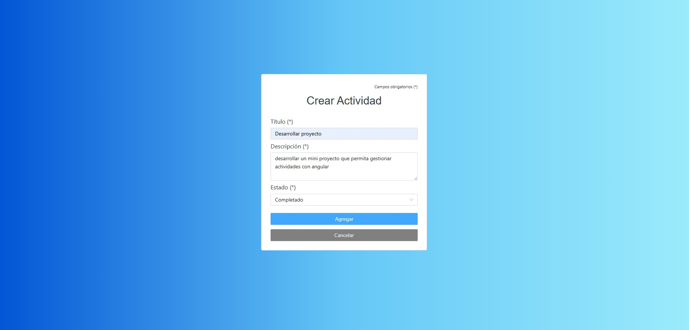
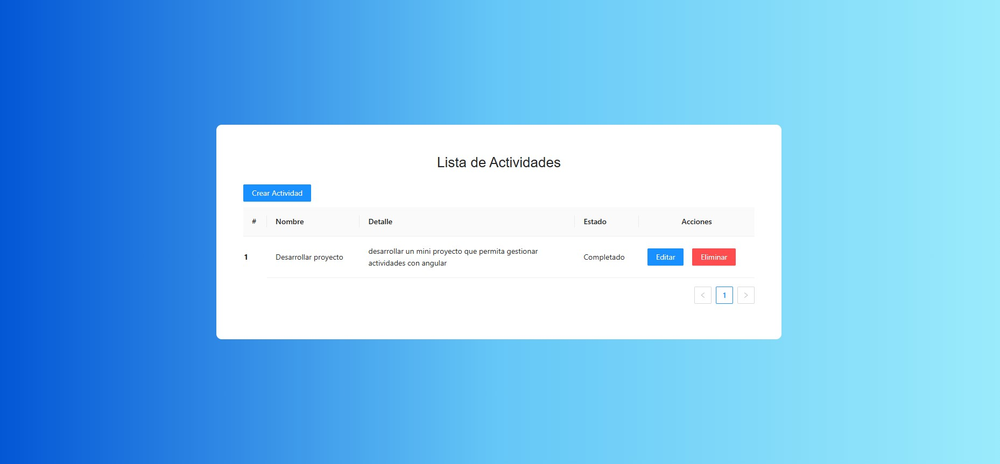
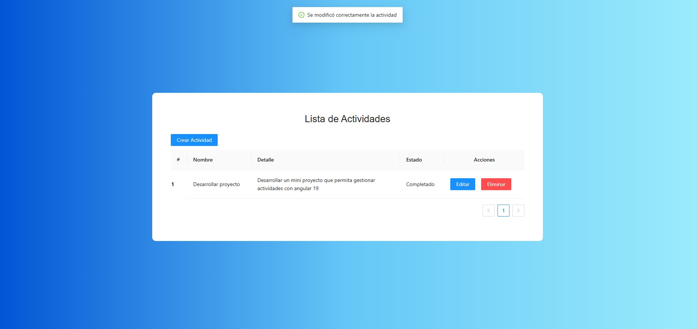
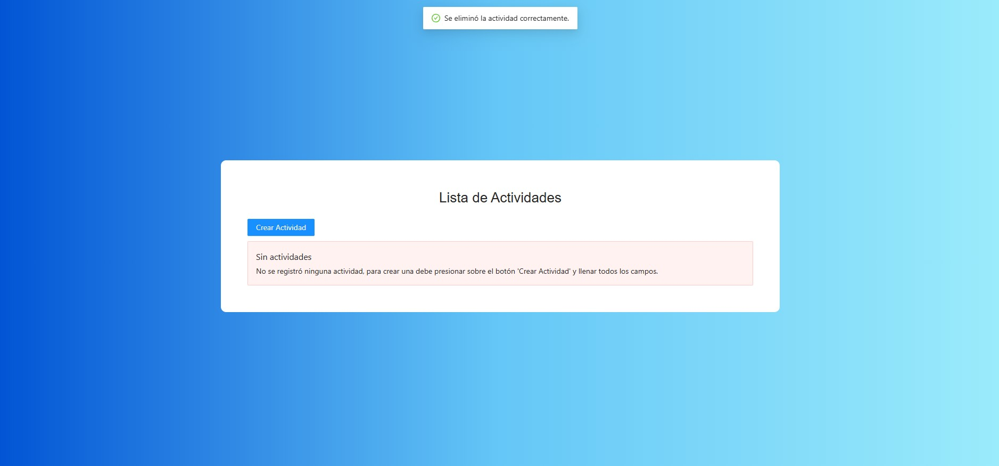

# TaskProject

El proyecto se desarrolló en angular 19.0.0, para la parte UI se utilizó ng-zorro 19.2.2.

El proyecto realiza las siguientes acciones:

- registro de actividades
- edición de actividades
- listado de actividades
- eliminación de actividades

### Registro

### Listado

### Edición

### Eliminación

